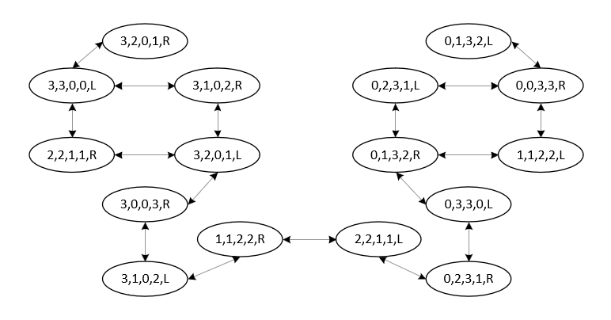

# 人工智能导论第一次作业

## 3.7 给出下列问题的初始状态、目标测试、后继函数和耗散函数

### a. 只用四种颜色对平面地图染色，要求每两个相邻的地区不能染成相同的颜色

状态空间：所有染色情况集合

1. 初始状态：地图所有格子未染色
2. 目标测试：地图所有格子已经染色，且每两个相邻地区的颜色不同
3. 后继函数：选择一个地区染色
4. 耗散函数：染色次数

### b.一间屋子里有一只3英尺高的猴子，屋子的房顶上挂着一串香蕉，离地面8公尺。屋子里有两个可叠放起来、可移动、可攀登的3英尺高的箱子。猴子很想得到香蕉。

状态空间：房间内猴子、箱子的位置以及猴子的状态

1. 初始状态：如题目描述
2. 目标测试：猴子得到香蕉
3. 后继函数：一系列动作，包括猴子攀爬上/下某个箱子，猴子搬运某个箱子到指定位置，猴子拿香蕉
4. 耗散函数：猴子采取的动作次数

### c.有一个程序，当送入一个特定文件的输入记录时会输出“不合法的输入记录”。已知每个记录的处理独立于其它记录。要求找出哪个记录不合法。

状态空间：待测试的记录集合

1. 初始状态：所有的记录集合
2. 目标测试：记录集合中仅有一个记录
3. 后继函数：将记录集合分成最多数量相差1的两半，分别用程序测试，输出“不合法”的那一半作为新的状态
4. 耗散函数：使用程序的次数

### d.有三个水壶，容量分别为12加仑、8加仑和3加仑，还有一个水龙头。可以把壶装满或者倒空，从一个壶倒进另一个壶或者倒在地上。要求量出刚好1加仑水。

状态空间：三元组，分别表征三个水壶当前的水量

1. 初始状态：三个水壶水量为0

2. 目标测试：三个水壶有一个水量为1

3. 后继函数：一些可选操作，将某壶装到满或者倒空，或者将A壶向B壶倒水直到B壶满或者A壶为空

4. 耗散函数：倒水次数

   

## 3.9 传教士与野人问题

**传教士和野人**问题通常描述如下：三个传教士和三个野人在河的一边，还有一条能载一个人或者两个人的船。找到一个办法让所有的人都渡到河的另一岸，要求在任何地方野人数都不能多于传教士的人数(可以只有野人没有传教士)。这个问题在AI领域中很著名,因为它是第一篇从分析的观点探讨问题形式化的论文的主题（Amarel, 1968）

### a.精确地形式化该问题，只描述确保该问题有解所必需的特性。画出该问题的完全状态空间图。

状态空间：三元组，河左岸的传教士和野人人数，船在哪一边，并且满足任何地方野人数不多于传教士人数或者只有野人，船在一个可能的位置

1. 初始状态：河左岸3个传教士、3个野人，船在左岸

2. 目标测试：河左岸0个传教士、0个野人

3. 后继函数：选定船所在一侧的传教士/野人上/下船，船摆渡到另一岸

4. 耗散函数：船摆渡次数

   

状态空间如图，其中用双向箭头表示同时存在状态 i 指向状态 j 和状态 j 指向状态 i 的边

### b.用一个合适的搜索算法实现和最优地求解该问题。检查重复状态是个好主意吗?

直接使用广度优先搜索，记录查找路径，第一个搜索到的目标状态的路径就对应着一个最少的摆渡次数的方案。由于状态空间小，因此事实上各种检测重复结点的最短路径搜索算法都可以。

有必要，可以防止在重复状态间陷入死循环。

### c.这个问题的状态空间如此简单，你认为为什么人们求解它却很困难?

尽管状态空间简单，困难在于需要具体地去实现检查重复状态、遍历某一个状态下所有合法的操作及目标状态、回溯。

