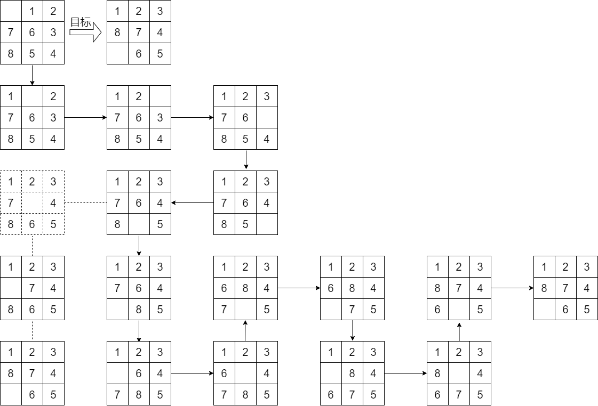

# 人工智能导论第二次作业

## **4.1** 跟踪A∗搜索算法用直线距离启发式求解从Lugoj到Bucharest问题的过程。按顺序列出算法扩展的节点和每个节点的f,g,h值。

解：两点之间直线最短，故对于任意节点 $a,b$ 和目标节点 $c$ ， $h(a,c)$ 作为 $a$ 与 $c$ 之间的直线距离必然 $\le a$ 与 $b$ 之间的距离 + $b$ 与 $c$ 之间的直线距离，故可知其满足一致性，可以使用图算法拓展的A*搜索算法。此处用 $name(f,g,h)$ 表示每个节点及其 $f,g,h$ 值

1. Lugoj(244,0,244)
2. Mehadia(311,70,241) , Timisoara(440,111,329)
3. Dobreta(387,145,242)
4. Craiova(425,265,160)
5. Pitesti(503,403,100) , Rimnicu Vilcea(604,411,193)
6. Arad(595,229,366)
7. Bucharest(504,504,0)

## 4.2 启发式路径算法是一个最佳优先搜索，它的目标函数是 $f(n) = (2 - \omega )g(n) + \omega h(n)$ 。算法中 $\omega $ 取什么值能保证算法是最优的?当 $\omega = 0$ 时，这个算法是什么搜索? $\omega = 1$ 呢? $\omega = 2$ 呢?

解：考虑
$$
f(n) = (2 - \omega )g(n) + \omega h(n) = (2 - \omega) (g(n) + \frac{\omega }{2-\omega } h(n))
$$
仅考虑$(2-\omega )$系数后面的部分，令$h'(n) = \frac{\omega }{2 - \omega }h(n)$，则在$h(n)$作为一个单独函数本身满足其可采纳的情况下，若
$$
h'(n) = \frac{\omega }{2-\omega } h(n) \le h(n)
$$
即 $\omega \le 1$ ，那么
$$
h'(n) \le h(n) \le h^*(n)
$$
所以这种情况下 $h'(n) $ 是可采纳的，即可以保证算法是最优的

由定义得

当 $\omega = 0$ 时，这个算法是一致代价搜索

当 $\omega = 1$ 时，这个算法是A*搜索

当 $\omega = 2$ 时，这个算法是贪心搜索

## 4.6 设计一个启发函数，使它在八数码游戏中有时会估计过高，并说明它在什么样的特殊问题下会导致非最优解。(可以借助计算机的帮助。)证明：如果 $h$ 被高估的部分从来不超过 $c$ ， $A^* $ 算法返回的解的耗散比最优解的耗散多出的部分也不超过 $c$ 。

解：设计启发函数如下——

$h(n)$是如此一个函数，当它处在某个特定状态时，其值极大（显然可以做到足够大使得其远超出实际的耗散，并且下一步的拓展必然不选择该状态），其余状态均定义为不在位的棋子数，于是由图可见一特殊问题例子

下面对本图做一些说明，每个状态由一个九宫格标记，其中虚线九宫格所对应的就是该 $h(n)$ 定义中被赋予足够大值的”特殊状态“。其中”目标“箭头由初始状态指向目标状态，而实箭头表示按照上述 $h(n)$ 定义下所搜索到的解，在箭头的分支处，虚线箭头表示这一步之后本应当是最优解的各步骤。显然这个启发函数在箭头分支处导致了估计过高，并且最后找出来的解也不是最优解。

下面证明命题。

证明：对于任意的节点 $s_0$ 与目标 $s$ ，考虑其基于此处的启发式函数的扩展序列 $s_1,s_2,\dots ,s_n,s$ ,与此同时另有一条最优路径的序列 $s_1',s_2',\dots ,s_m',s$ ，设 $s_i = s_j',s_{i+1}\neq s_{j+1}'$，且 $s_{i+1}$ 并不在基于启发式函数求出的解的路径上。那么有

$$ g(s) = f(s)\le f(s_{i+1}) \le f(s_{i+1}') \le g(s_{i+1}') + h^*(s_{i+1}) + c = h^*(s_0)+c$$

证毕

## 4.7 证明如果一个启发式是一致的，它肯定是可采纳的。构造一个非一致的可采纳启发式。

证明：首先，如果启发式 $h(n)$ 是一致的，即对于任何状态 $i,j$ 以及目标状态 $s$ ，设 $j$ 为 $i$  的后继，则 $h(i) + c(i,j) \ge h(j)$ 。

那么对于任一节点 $s_0$ ，考虑其到目标状态 $s$ 最短路径上的一系列节点 ${s_1,s_2,\dots , s_n}$ ，那么有
$$
h^*(s_0) = c(s_0,s_1) + c(s_1+s_2) + \dots + c(s_n , s) \ge (h(s_n)-h(s))+\dots + (h(s_1) - h(s_2)) + (h(s_0)-h(s_1)) = h(s_0) - h(s) = h(s_0)
$$
故得到结论
$$
h(s_0) \le h^*(s_0)
$$
由于节点 $s_0$ 的选取是任意的，得证其满足可采纳性

构造：如图

首先易知 $h(s0) = 8.5 \le h^*(s0) = 9,h(s1) = 3 \le h^*(s1) = 5,h(s) = 0$ ，满足一致性要求，但是 $h(s0) = 8.5 > c(s0,s1) + h(s1) = 5 + 3 = 8$ 。并不具备一致性。