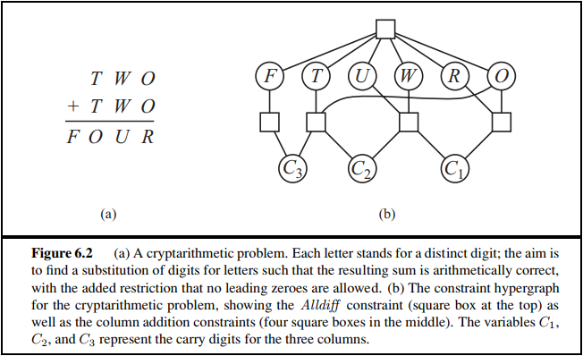
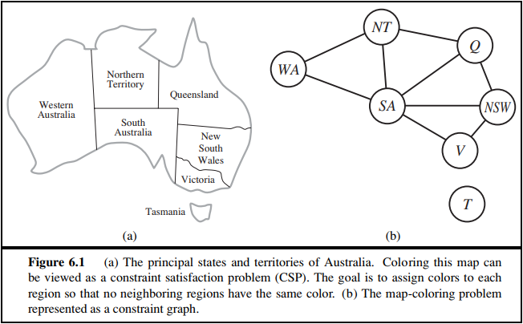

# 人工智能第三次作业

## **6.5** Solve the cryptarithmetic problem in Figure 6.2 by hand, using the strategy of backtracking with forward checking and the MRV and least-constraining-value heuristics.

解：从上往下，从左往右，每个多元约束分别为

- F、T、U、W、R、O互不相同
- F = $C_3$
- $C_3 \times $ 10 + O = 2 $\times $ T + $C_2 $ 
- $C_2 \times$ 10 + U = 2 $\times $ W + $C_1 $ 
- $C_1 \times $ 10 + R = 2 $\times $ O

由单元约束，T、U、W、R、O均为0-9之间的数字，F和$C_1,C_2,C_3$取值均为0或1。

罗列算法模拟执行步骤如下

- 选定T为初始变量，因为它是度数最高的节点之一
- T尝试赋值1,在当前信息下这是可能的给邻居变量留下最多选择的赋值之一
- 前向检验，F、U、W、R以及 $C_3$ 删去1，O的取值范围删至 $\{2,3\}$ 。
- 由MRV，选定F为下一个变量，因为它是取值范围最小的变量之一
- F尝试赋值0，因为其仅有一个赋值可能
- 前向检验，U,W,R删去0
- 由MRV，选定 $C_3$ 为下一个变量，因为它是取值范围最小的变量之一
- $C_3$ 尝试赋值0，因为其仅有一个赋值可能
- 前向检验，无变动
- 由MRV，选定O为下一个变量，因为它是取值范围最小的变量之一
- O尝试赋值3，在当前信息下这是可能的给邻居变量留下最多选择的赋值之一
- 前向检验，R的取值范围删至 $\{6\} $ ，$C_1$ 的取值范围删至 $\{0\} $，$C_2$ 的取值范围删至 $\{1\}$，U、W删去3
- 由MRV，选定R为下一个变量，因为它是取值范围最小的变量之一
- R尝试赋值6，因为其仅有一个赋值可能
- 前向检验，U、W删去6
- 由MRV，选定 $C_1$ 为下一个变量，因为它是取值范围最小的变量之一
- $C_1$ 尝试赋值0，因为其仅有一个赋值可能
- 前向检验，U的取值范围删至 $\{4,8\}$，Ｗ的取值范围删至 $\{7,9\}$ 。
- 由MRV，选定 $C_2$ 为下一个变量，因为它是取值范围最小的变量之一
- $C_2$ 尝试赋值1，因为其仅有一个赋值可能
- 前向检验，无变动
- 由MRV，选定U为下一个变量，因为它是取值范围最小的变量之一
- U尝试赋值4，在当前信息下这是可能的给邻居变量留下最多选择的赋值之一
- 前向检验，W删去9
- 由MRV，选定W为下一个变量，因为它是取值范围最小的变量之一
- W尝试赋值7，因为其仅有一个赋值可能
- 前向检验，无变动
- 完成，得到一个赋值方案

## **6.11** Use the AC-3 algorithm to show that arc consistency can detect the inconsistency of the partial assignment WA=green,V=red for the problem shown in Figure 6.1

解：罗列算法模拟执行步骤如下

- 队列中放入所有边（二元约束条件），除WA,V外，所有节点的可能属性值集合为 $\{red,yellow,green\}$ 。
- <SA，WA> 出队列，从SA中去掉 $green$ ，将<NT,SA>、<Q,SA>、<NSW,SA>、<V,SA>、<WA,SA>加入队列（如果队列中没有的话）
- <SA，V> 出队列，从SA中去掉 $red$ ，将<NT,SA>、<Q,SA>、<NSW,SA>、<V,SA>、<WA,SA>加入队列（如果队列中没有的话）
- <NT，WA> 出队列，从NT中去掉 $green$ ，将<WA,NT>、<SA,NT>、<Q,NT>加入队列（如果队列中没有的话）
- <NT，SA> 出队列，从NT中去掉 $yellow$ ，将<WA,NT>、<SA,NT>、<Q,NT>加入队列（如果队列中没有的话）
- <NSW，V> 出队列，从NSW中去掉 $red$ ，将<V,NSW>、<SA,NSW>、<Q,NSW>加入队列（如果队列中没有的话）
- <NSW，SA> 出队列，从NSW中去掉 $yellow$ ，将<V,NSW>、<SA,NSW>、<Q,NSW>加入队列（如果队列中没有的话）
- <Q,NT>出队列，从Q中去掉 $red$ ，将<NT,Q>、<SA,Q>、<NSW,Q>加入队列（如果队列中没有的话）
- <Q,SA>出队列，从Q中去掉 $yellow$ ，将<NT,Q>、<SA,Q>、<NSW,Q>加入队列（如果队列中没有的话）
- <Q,NSW>出队列，从Q中去掉 $green$ ，将<NT,Q>、<SA,Q>、<NSW,Q>加入队列（如果队列中没有的话）
- 此时Q的可能属性值集合已经为空集，返回错误

## **6.12** What is the worst-case complexity of running AC-3 on a tree-structured CSP?

解：假设有 $n$ 个节点，那么由于其为树结构，所以有 $n-1$ 条边（二元约束条件），假设每个节点至多有 $k$ 个取值可能，不妨将边加入队列的次数和删减取值的次数分开统计，那么在执行AC-3算法的过程中，每一条边（二元约束条件）上至多执行 $k$ 次删减取值的操作，同时也至多 $k$ 次加入队列， 所以在不考虑revise检查相容性的开销的情况下，总时间复杂度为 $O(nk)$ 。

但是如果考虑revise检查相容性的开销，每次相当于O(两个结点的取值可能数的乘积)。那么总时间复杂度直接为 $O(nk^3)$ 。

