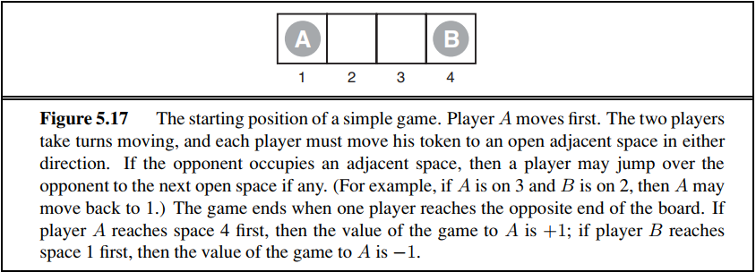
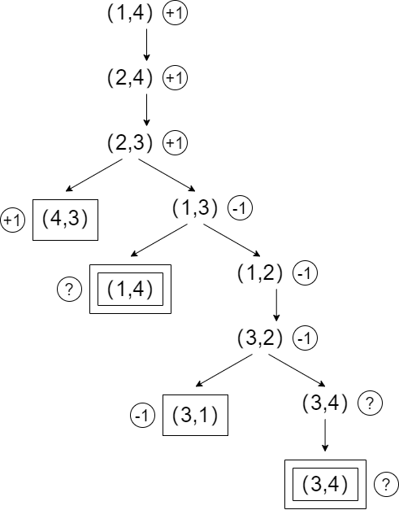

# 人工智能第四次作业

## **5.9** This problem exercises the basic concepts of game playing, using tic-tac-toe (noughts and crosses) as an example.

 We define $X_n$ as the number of rows, columns, or diagonals with exactly $n X′s$ and no $O′s$. Similarly, On is the number of rows, columns, or diagonals with just $n O′s$. The utility function assigns$+1$ to any position with $X_3=1$ and $−1$ to any position with $O_3=1$. All other terminal positions have utility $0$. For nonterminal positions, we use a linear evaluation function defined as $Eval(s)=3X_2(s)+X_1(s)−(3O_2(s)+O_1(s))$.

### **a.** Approximately how many possible games of tic-tac-toe are there?

解：考虑双方每轮落子，最多九轮，那么可能的棋局估计上限值为$ 9! $

### **b.** Show the whole game tree starting from an empty board down to depth 2 (i.e., one $X$ and one $O$ on the board), taking symmetry into account.

解：绘制如图，本大题c、d、e三小题也均按照此图解答。

### **c.** Mark on your tree the evaluations of all the positions at depth 2.

解：如b小题图，已经将评估函数值标记在所有对应着深度为2的棋局的结点的下方。

### **d.** Using the minimax algorithm, mark on your tree the backed-up values for the positions at depths 1 and 0, and use those values to choose the best starting move.

解：如b小题图，已经将根据极小极大算法算出的倒推值标记在所有对应着深度为1或0的棋局的结点的附近。

所以最好的起始行棋是把X下在最中间。

### **e.** Circle the nodes at depth 2 that would not be evaluated if alpha–beta pruning were applied, assuming the nodes are generated in the optimal order for alpha–beta pruning.

解：如b小题图，为了呈现方便，所有被剪掉的结点边框都采用了加粗显示（亦可看做是一种“circle”）。

假设先探索完了X先打在最中间的结点及其子树，随后另外两种X初次位置可能的两个结点所有的子节点里，都先探索完实际minmax值最小的结点，这样一来根据 $\alpha - \beta$ 剪枝，其它的子节点就没有被探索的需要。

## **5.8** Consider the two-player game described in **Figure 5.17**.

### **a.** Draw the complete game tree, using the following conventions:

- Write each state as $(s_A,s_B)$, where $s_A$ and $s_B$ denote the token locations.
- Put each terminal state in a square box and write its game value in a circle.
- Put *loop states* (states that already appear on the path to the root) in double square boxes. Since their value is unclear, annotate each with a “?” in a circle.

解：绘制图如下

### **b.** Now mark each node with its backed-up minimax value (also in a circle). Explain how you handled the “?” values and why.

解：极大极小值如a小题图。

“?”做如下处理：

- 循环状态设置值为“?”
- 子结点中有“?”状态的情况，优先排除所有“?”值，对于剩下的按照原先的极大极小值算法进行倒推，若有的话则选择相应的最大/最小值对应结点的行动，如果排除“?”值后就没有值了，那么该结点倒推值为“?”，选择一个对应“?”的行动

原因：当一个结点面临两种选择，一者是选择眼下可预见的"更佳"的行动，一者是直接进入未知的循环状态。此处假定了agent总是选择“更佳”的行动，这也有助于防止进入或者尽早跳出循环，并减少了“?”状态的传播。

### **c.** Explain why the standard minimax algorithm would fail on this game tree and briefly sketch how you might fix it, drawing on your answer to **(b)**. Does your modified algorithm give optimal decisions for all games with loops?

解：在循环状态处会产生无限递归循环导致算法无法终止。

方法正如a小题图所示，修改后的算法维护每次的递归搜索栈，一旦发现新搜索到的结点和栈中已有的结点重复，那就说明这个新结点是循环结点，这时候对其终止递归调用，直接返回“?”。同时在极大极小值的计算中加入b小题所述的针对"?"的扩展。

并不一定对所有带循环的游戏都能给出最优选择。假如一个游戏中主动进入循环的一方每进行一轮循环都将得到更高的收益，显然此处应当总是选择进入未知的循环状态而不是选择眼下可预见的“更佳”的行动。

### **d.** This 4-square game can be generalized to n squares for any $n>2$. Prove that $A$ wins if $n$ is even and loses if $n$ is odd.

解：当n为偶数，A先采取一直向右移动，不论B如何移动，A与B必然相遇，而且此时由于格子数为偶数，相遇之后必然是A先开始行动。令A跳过B前往下一格，B要么继续往左移动，如此A必然先B一步到达右端，B也可以往回跳过A，但如此一来又回到了A与B相遇且A先开始行动的情况，而且A相对于之前向右行进了2格，因此在有限的格子内这个情况并不会反复出现。采用如此策略后，必将终止于两种情况，其一是A直接一直向右移动到最右端，其二是B位于最右端，而A处于B的左边，而下一步是A行动，此时A只需向左走一格，那么B不得不向左走一格，之后A向右跳至最右端即可。

当n为奇数，情况与前者相反，A与B必然相遇，但此时相遇后必然是B先开始行动，后续同理可知B有必胜策略。

## **5.13** Develop a formal proof of correctness for alpha–beta pruning. 

To do this, consider the situation shown in **Figure 5.18**. The question is whether to prune node $n_j$, which is a maxnode and a descendant of node $n_1$. The basic idea is to prune it if and only if the minimax value of $n_1$ can be shown to be independent of the value of $n_j$.

### a. Mode $n_1$ takes on the minimum value among its children: $n_1=min(n_2,n_{21},\dots ,n_{2b_2})$. Find a similar expression for $n_2$ and hence an expression for $n_1$ in terms of $n_j$.

解：设$n_2 = max(n_3,n_{31},\dots ,n_{3b_3})$ ，于是 $n_1 = min(max(n_3,n_{31},\dots ,n_{3b_3}),n_{21},\dots n_{2b_2})$ ，如此递归展开下去直到其中出现$n_j$ 。

### b. Let $l_i$ be the minimum (or maximum) value of the nodes to the left of node $n_i$ at depth $i$, whose minimax value is already known. Similarly, let $r_i$ be the minimum (or maximum) value of the unexplored nodes to the right of $n_i$ at depth $i$. Rewrite your expression for $n_1$ in terms of the $l_i$ and $r_i$ values.

解：$n_1 = min(max(n_3,l_3,r_3),l_2,r_2)$ ，如此递归展开下去直到出现 $min(n_j,l_j,r_j)$ 。

### c. Now reformulate the expression to show that in order to affect $n_1,n_j$ must not exceed a certain bound derived from the $l_i$ values.

解：若$ n_1 $的取值需要收到 $n_j$ 的影响，那么首先 $n_2$ 的估计值不应当被判定为$ \ge l_2 $，即 $max(n_3,l_3,r_3)$ 的估计值不应被判定为$\ge l_2$ ，且由于 $ n_3 $ 也应当对结果产生影响，$n_3 $的估计值不应被判定为 $\ge l_2$并且 $n_3 $ 不应被判定为 $\le l_3$。如此递归下去得到 $n_j$ 的值不应当超过之前 $min\{ l_i | i=2,4,\dots ,j \}$ 的值。 

### d. Repeat the process for the case where $n_j$ is a min-node.

解：同上，首先$n_1 = min(max(n_3,n_{31},\dots ,n_{3b_3}),n_{21},\dots n_{2b_2})$ ，如此递归展开下去直到出现 $n_j$ 。于是有 $n_1 = min(max(n_3,l_3,r_3),l_2,r_2)$ ，如此递归展开下去直到出现 $max(n_j,l_j,r_j)$ 。最后得到 $n_j$ 的值不应当小于 $max\{l_i|i=3,5,\dots ,j\}$ 。