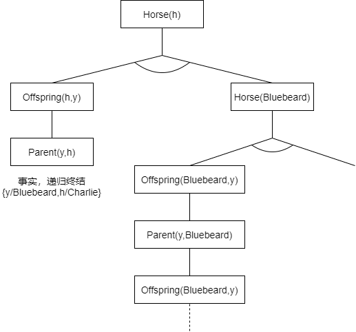

# 人工智能第六次作业

## 8.24 Represent the following sentences in first-order logic,using a consistent vocabulary(which you must define);
* **a.** Some students tool French in spring 2001.
* **b.** Every student who takes French passes it.
* **c.** Only one student took Greek in spring 2001.
* **d.** The best score in Greek is always higher than the best score in French.
* **e.** Every person who buys a policy is smart.
* **f.** No person buys an expensive policy.
* **g.** There is an agent who sells policies only to people who are not insured.
* **h.** There is a barber who shaves all men in town who do not shave themselves.
* **i.** A person born in the UK,each of whose parents is a UK citizen or a UK resident,is a UK citizen by birth.
* **j.** A person born outside the UK,one of whose parents is a UK citizen by birth,is a UK citizen by descent.
* **k.** Politicians can fool some of the people all of the time,and they can fool all of the people some of the time,but they can’t fool all of the people all of the time.

首先，根据题意定义一系列函数和常量
* Take(student,course,time),真值函数,student在time的时候上了course
* Pass(student,course),真值函数,student通过了course的考试
* Score(student,course,time),返回student在time的时候上了course的成绩
* Gt(scores,scoreb),真值函数，分数scorea比分数scoreb高
* EQ(x,y),真值函数，x和y相同
* isSmart(person),真值函数，person是聪明的
* Buy(person,good),真值函数，person买了good
* Sell(x,y,z),真值函数，x卖z给y
* isStudent(x),真值函数，x是学生
* isPerson(x),真值函数，x是人
* isPolicy(x),真值函数，x是保险
* isAgent(x),真值函数，x是代理
* isBarber(x),真值函数，x是理发师
* isEngCitizen(x,t),真值函数，x在t程度上是英国公民
* isEngLiver(x,t),真值函数，x在t程度上是英国永久居住者
* isPolitician(x),真值函数，x是政治家
* isExpensive(x),真值函数，x是昂贵的
* isInsured(x),真值函数，x已经投保
* isIntown(x),真值函数，x在镇上
* isMan(x),真值函数，x是男人
* Shave(x,y),真值函数，x给y刮胡子
* Born(x,y),真值函数，x出生于y
* Parent(x,y),真值函数，x是y的双亲之一
* Fool(x,y,t),真值函数，x在t时候愚弄y
* 各类常量，比如French，Greek，2001Spring，England，Birth，Descent

于是将诸语句表示如下
   * **a.** $\exists x(isStudent(x) \land Take(x,French,2001Spring))$

   * **b.** $\forall x((isStudent(x)\land \exists time (Take(x,French,time)))\Rightarrow Pass(x,French))$

   * **c.** $\exist x(is Student(x) \land Take(x,Greek,2001Spring) \land (\forall y(\neg EQ(x,y) \Rightarrow \neg Take(x,Greek,2001Spring))))$

   * **d.** $\forall time \exist x \forall y GT(Score(x,Greek,time),Score(y,French,time))$

   * **e.** $\forall x(isPerson(x)\land (\exist y(isPolicy(y) \land Buy(x,y)))\Rightarrow isSmart(x))$

   * **f.** $\neg \exist x(isPerson(x) \land \exist y(isPolicy(y) \land Buy(x,y) \land isExpensive(y)))$

   * **g.** $\exist x(isAgent(x) \land \forall y,z((Sell(x,y,z)\land isPerson(y)\land isPolicy(z))\Rightarrow \neg isInsured(y) ))$

   * **h.** $\exist x(isBarber(x) \land \forall y((isIntown(y)\land isMan(y) \land \neg Shave(y,y)) \Rightarrow Shave(x,y)))$

   * **i.** 此处将题意理解为，成为英国公民或永久居住者之后这身份始终有效，而且此处的父母可以不是人类
        $$
        \begin{equation}
        	\begin{aligned}
        		\forall x(isPerson(x) &\land Born(x,England) \land \\
        		&\forall y(Parent(y,x)\Rightarrow \exist t(EngCitizen(y,t)\lor EngLiver(y,t)))\\
        		\Rightarrow &EngCitizen(x,Birth))
        	\end{aligned} \nonumber
        \end{equation}
        $$

   * **j.** 此处理解同上
        $$
        \begin{equation}
        	\begin{aligned}
        		\forall x(isPerson(x) &\land \neg Born(x,England) \land \\
        		&\exist y(Parent(y,x)\land EngCitizen(y,Birth))\\
        		\Rightarrow &EngCitizen(x,Descent))
        	\end{aligned}\nonumber
        \end{equation}
        $$

   * **k.** 同样，政治家也可以不是人，这取决于具体的语义
        $$
        \begin{equation}
        	\begin{aligned}
        		\forall x(isPolitician(x) &\Rightarrow \\
        		&(\exist y \forall t Fool(x,y,t)) \\
        		&\land (\exist t\forall y Fool(x,y,t))\\
        		&\land \neg(\forall y \forall t Fool(x,y,t)))
        	\end{aligned}\nonumber
        \end{equation}
        $$

## 8.17 Explain what is wrong with the following proposed definition of adjacent squares in the wampum world:
$$ \forall x,y \quad Adjacent([x,y],[x+1,y]) \wedge Adjacent([x,y],[x,y+1])$$

解：这个定义太过简陋且有谬误，它仅仅规定了所有格子与其右侧与上侧的格子相连（假设右和上分别是$x$和$y$的增长方向），那么当格子位于右侧与上侧的边缘时，显然其是错误的，因为这些边缘上的格子已经没有右侧或者上侧的格子与之对应。而且，处于非边缘处的格子理应有四个方向的格子与其相连，而这里仅仅提到了两个。最后，其并没有显式规定其它的格子是否相连，比如那些相距3个格子的格子。

## 9.3 Suppose a knowledge base contains just one sentence,3 x AsHighAs(x,Everest).Which of the following arc legitimate results of applying Existential Instantiation?
* **a.** $AsHighAs(Everest,Everest)$
* **b.** $AsHighAs(Kilimanjaro,Everest)$
* **c.** $AsHighAs(Kilimanjaro,Everest) \wedge AsHighAs(BenNevis,Everest)$(after two applications)

解：只有**b**是合法的。**a**替换了同名符号，而**c**将存在量词实例化用了两次。

## 9.4 For each pair of atomic sentences, give the most general unifier if it exists:
* **a.** $P(A,B,B),P(x,y,z)$
* **b.** $Q(y,G(A,B)),Q(G(x,x),y)$
* **c.** $Older(Father(y),y),Older(Father(x),John)$
* **d.** $Knows(Father(y),y),Knows(x,x)$

解：由题意，分析如下

- **a.** $Unify(P(A,B,B),P(x,y,z)) = \{x/A,y/B,z/B\} $
- **b.** $Unify(Q(y,G(A,B)),Q(G(x,x),y)) = fail$
- **c.** $Unify(Older(Father(y),y),Older(Father(x),John)) = \{x/John,y/John\} $
- **d.** $Unify(Knows(Father(y),y),Knows(x,x)) = fail$

## 9.6  Write down logical representations for the following sentences, suitable for use with Generalized Modus Ponens:

- **a.** Horses, cows, and pigs are mammals.
- **b.** An offspring of a horse is a horse.
- **c.** Bluebeard is a horse.
- **d.** Bluebeard is Charlie’s parent.
- **e.** Offspring and parent are inverse relations.
- **f.** Every mammal has a parent.

解：词汇表如下

- $Horse(),Cow(),Pig()$：是马/牛/猪
- $Offspring(x,y)$：x是y的后代
- $Parent(x,y)$：x是y的双亲
- $Mammal(x)$：x是哺乳动物

，由题意罗列如下

- **a.** 
  $$
  \begin{equation}
  	\begin{aligned}
  		Horse(x) \Rightarrow Mammal(x) \\
  		Cow(x) \Rightarrow Mammal(x) \\
  		Pig(x) \Rightarrow Mammal(x)
  	\end{aligned}\nonumber
  \end{equation}
  $$

- **b.** $Horse(y) \land Offspring(x,y) \Rightarrow Horse(x)$

- **c.** $Horse(Bluebeard)$

- **d.** $Parent(Bluebeard,Charlie)$

- **e.** 
  $$
  \begin{equation}
  	\begin{aligned}
  		Offspring(x,y) \Rightarrow Parent(y,x) \\
  		Parent(y,x) \Rightarrow Offspring(x,y)
  	\end{aligned} \nonumber
  \end{equation}
  $$

- **f.** $Mammal(x) \Rightarrow Parent(M(x),x)$ 

## 9.13  In this exercise, use the sentences you wrote in Exercise 9.6 to answer a question by using a backward-chaining algorithm.

- **a.** Draw the proof tree generated by an exhaustive backward-chaining algorithm for the query $\exist h Horse(h)$, where clauses are matched in the order given.
- **b.** What do you notice about this domain?
- **c.** How many solutions for $h$ actually follow from your sentences?

**a.** 解：由题意绘图如下

**b.** 解：由上图可见其陷入了无限循环。一方面这说明了后向链接算法并不完备，另一方面也可以看出来，match的顺序对于算法运行的过程和结果有着很大的影响，如果最先被match的是 $Horse(Bluebeard)$ 而非 $Horse(y) \land Offspring(x,y) \Rightarrow Horse(x)$ ,那么算法将直接终结而不是陷入无限循环。

**c.** 解：$Bluebeard$ ， $Charlie$都是满足 $Horse(h)$ 的。