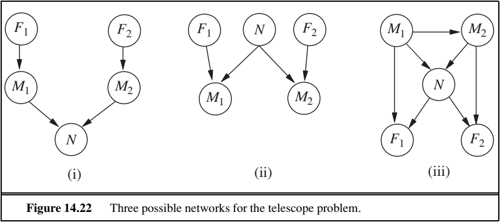
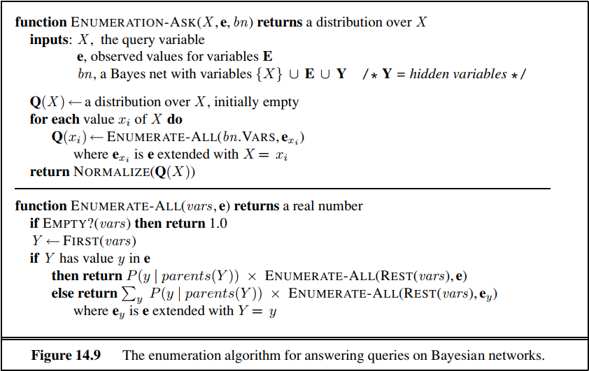

# 人工智能第八次作业

## 14.12

Two astronomers in different parts of the world make measurements $M_1$ and $M_2$ of the number of stars $N$ in some small region of the sky, using their telescopes. Normally, there is a small possibility $e$ of error by up to one star in each direction. Each telescope can also (with a much smaller probability $f$ ) be badly out of focus (events $F_1$ and $F_2$ ), in which case the scientist will undercount by three or more stars (or if $N$ is less than $3$ , fail to detect any stars at all). Consider the three networks shown in Figure 14.22.

- **a. ** Which of these Bayesian networks are correct (but not necessarily efficient) representations of the preceding information?
- **b**. Which is the best network? Explain.
- **c**. Write out a conditional distribution for $P(M_1|N)$, for the case where $N\in 1,2,3$ and $M_1\in 0,1,2,3,4$ . Each entry in the conditional distribution should be expressed as a function of the parameters $e$ and/or $f$ .
- **d**. Suppose $M_1=1$ and $M_2=3$ . What are the possible numbers of stars if you assume no prior constraint on the values of $N$ ?
- **e**. What is the *most likely* number of stars, given these observations? Explain how to compute this, or if it is not possible to compute, explain what additional information is needed and how it would affect the result.

**解答：**分小题解答如下

- **a.** （i）情况并不正确，星星的实际数目不应当对于每次望远镜对焦得到的数目是无关系的存在。（ii）正确，（iii）则是根据一定的考虑顺序，将隐性的关系也放了进来，它同样是正确的。
- **b.** 最好的情况应该是（ii），不考虑错误的（i），与（iii）相较，其更加精简，保留了最关键的关联。
- **c.** 条件概率表如下（此处将 $e$ 理解为多/少数一颗星星的概率，即二者分开计算，同时若因对焦问题丢失星星，在 $N \le 3$ 的情况下，数出来的必然是0）

| $P(M_1|N)$ | $N = 1$       | $N = 2$       | $N = 3$       |
| ---------- | ------------- | ------------- | ------------- |
| $M_1 = 0$  | $f+e(1-f)$    | $f$           | $f$           |
| $M_1 = 1$  | $(1-2e)(1-f)$ | $e(1-f)$      | 0             |
| $M_1 = 2$  | $e(1-f)$      | $(1-2e)(1-f)$ | $e(1-f)$      |
| $M_1 = 3$  | 0             | $e(1-f)$      | $(1-2e)(1-f)$ |
| $M_1 = 4$  | 0             | 0             | $e(1-f)$      |

- **d.** 可能是 $2,4,\ge 6$。
- **e.** 首先，我们需要知道星星数目的概率分布，不然将无法衡量在 $M_1 = 1,M_2 = 3$ 的情况下 $N$ 的取值的可能。此处对 $N$ 的分布做出假设，设 $N = 2$ 的概率为 $p_2$ ， $N = 4$ 的概率为 $p_4$ ， $N \ge 6$ 的概率为 $p_{\ge 6}$ 。同时，由于对焦丢失星星的具体颗数不明，所以此处仅仅列举诸概率的上限如下：

| $P( N = 2 , M_1 = 1 , M_2 = 3 )$ | $P( N = 4 , M_1 = 1 , M_2 = 3 )$ | $P( N \ge 6 , M_1 = 1 , M_2 = 3 )$ |
| -------------------------------- | -------------------------------- | ---------------------------------- |
| $p_2 e^2(1-f)^2$                 | $p_4 ef$                         | $p_{\ge 6}f^2$                     |

推断星星颗数最可能的数目时，需要结合以上概率进行判断。

## 14.13

Consider the network shown in Figure 14.22(ii), and assume that the two telescopes work identically. $N\in 1,2,3$ and $M_1,M_2\in 0,1,2,3,4,$ with the symbolic CPTs as described in Exercise 14.12. Using the enumeration algorithm (Figure 14.9 on page 525), calculate the probability distribution $P(N|M_1=2,M_2=2)$ .

**解答：** 枚举所有会导致 $M_1=2,M_2=2$ 的情况，将其按照 $N$ 的取值进行分类，分别求和计算其概率。由于此处仅需要考虑 $N = 1,2,3 $ 的情况，不难证明望远镜并没有出现对焦不准确的情况，设客观世界里星星数的概率分布满足 $P(N = 1) = p_1$ ，$P(N=2) = p_2$ ，$P(N=3) = p_3$。为精简起见计算其相对概率如下
$$
\begin{align*}
	<P(N=1|M_1=2,M_2=2),P(N=2|\dots ),P(N=2|\dots )> &= C<p_1e^2+0,p_2(1-2e)^2+0,p_3e^2+0> \\
	&= C<p_1e^2,p_2(1-2e)^2,p_3e^2>
\end{align*}
$$

