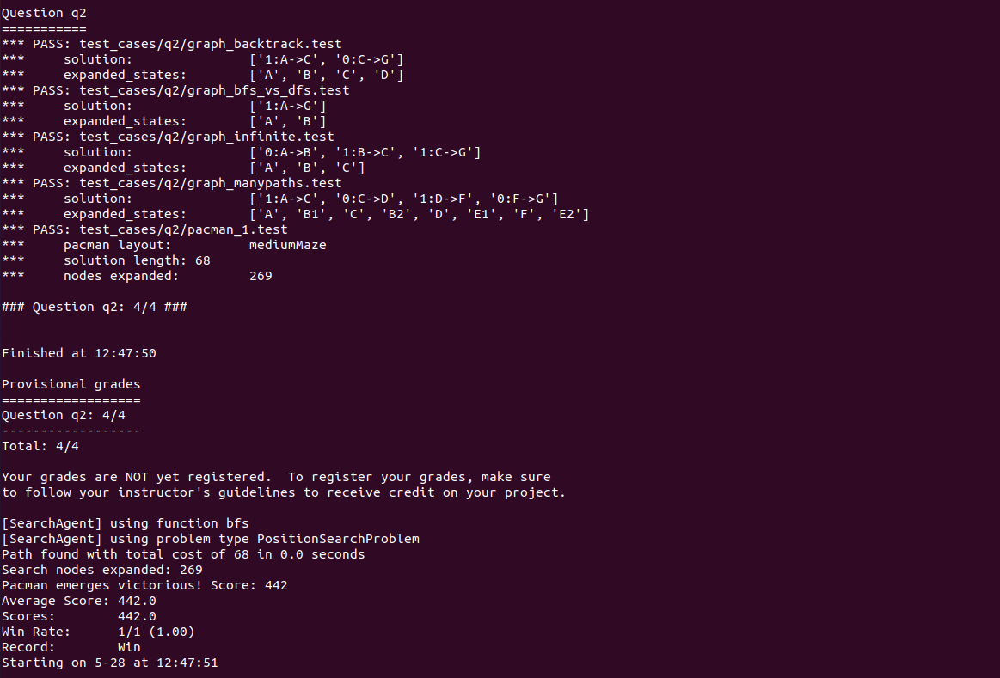
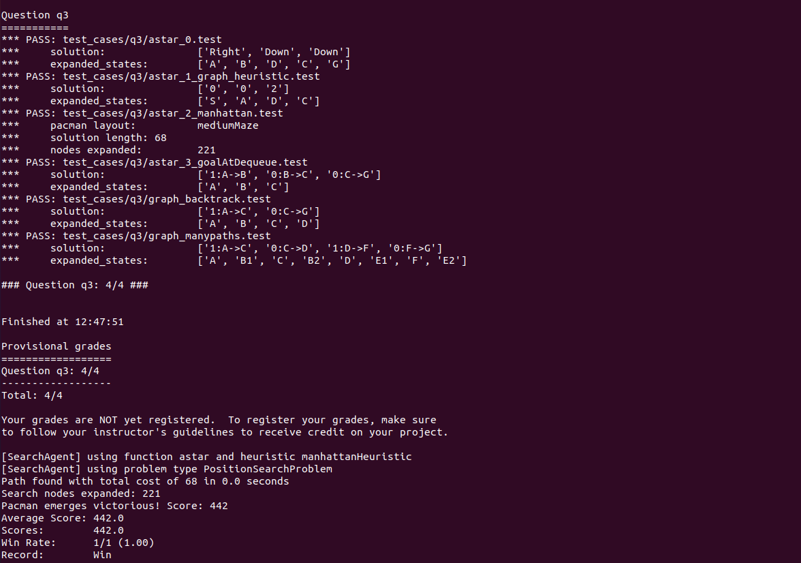
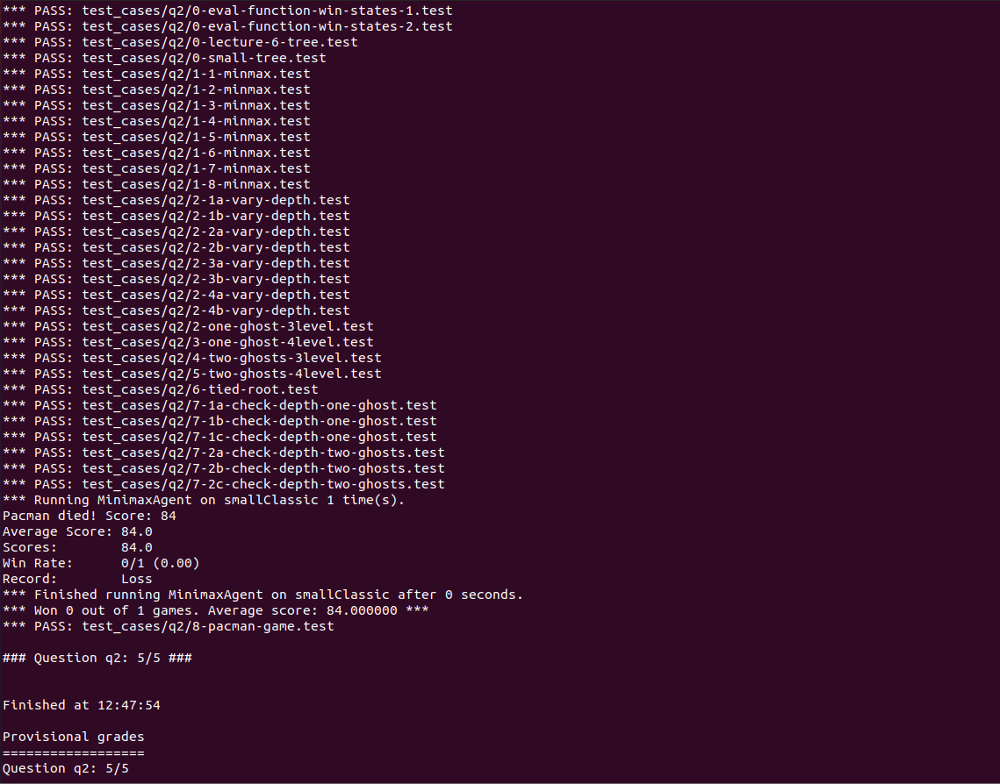

# 人工智能第一次实验

PB18051113 林成渊 2021/5/28

## 实验内容

### 总体描述

本次实验有2个部分，分别是Search和Multiagent。具体而言，Search的目标是吃豆人仅仅是寻找食物；Multiagent的目标是吃完所有食物，同时避开鬼。抽象而言，Search实现的静态查找算法，Multiagent的问题是在有对手的情况下做出下一步决策使自己的利益最大化。

### 实验目的

- Search部分实现BFS算法和A*算法。
- Multiagent部分实现minimax算法和alpha-beta剪枝。
- 加深课程知识理解，体会AI的设计思想

### 实验环境

- Ubuntu 
- Anaconda 3
- Python 3.6

## 实验过程

### BFS 算法

**思路：**源码中已经给出DFS算法的实现，DFS的实现基于数据结构——栈，将栈改为队列后即为BFS算法的实现。该算法首先将初始结点放入队列中，只要队列不空，就弹出一个结点，如果弹出的结点不是目标结点那就意味着可能需要继续查找它未被遍历过的后继，于是将其所有后继加入队列，如此循环往复，在这个过程中算法维护一个visit字典来记录每一个结点的前驱，如果弹出的结点正是目标结点，那么遍历结束，循着visit字典反向查找即可输出路径作为算法结果。于是直接调用实验包提供的队列实现如下：

```python
def myBreadthFirstSearch(problem):
    # YOUR CODE HERE
    visited = {}
    frontier = util.Queue()

    frontier.push((problem.getStartState(),None))

    while not frontier.isEmpty():
        state,prev_state = frontier.pop()

        if problem.isGoalState(state):
            solution = [state]
            while prev_state != None:
                solution.append(prev_state)
                prev_state = visited[prev_state]
            return solution[::-1]

        if state not in visited:
            visited[state] = prev_state

            for next_state, step_cost in problem.getChildren(state):
                frontier.push((next_state,state))

    #util.raiseNotDefined()
    return []
```

**实验结果：**



可见测试通过

### A* 算法

**思路：**与DFS和BFS类似，采用优先队列进行实现，每次弹出的是优先级最高的结点。除此之外，它还需要记录当前所搜索到的结点的耗散，以作为A* 算法的决策根据。故设置一个字典，采用类似于Dijkstra算法的思路动态规划地存储和更新每个搜索到的结点的耗散。书写具体代码如下

```python
def myAStarSearch(problem, heuristic):
    # YOUR CODE HERE
    visited = {}
    distance = {}
    frontier = util.PriorityQueue()

    initState = problem.getStartState()
    distance[initState] = 0
    frontier.push((initState,None),heuristic(initState))

    while not frontier.isEmpty():
        state,prev_state = frontier.pop()

        if problem.isGoalState(state):
            solution = [state]
            while prev_state != None:
                solution.append(prev_state)
                prev_state = visited[prev_state]
            return solution[::-1]

        if state not in visited:
            visited[state] = prev_state

            for next_state, step_cost in problem.getChildren(state):
                if next_state in distance.keys():
                    if (step_cost + distance[state]) < distance[next_state]:
                        distance[next_state] = step_cost + distance[state]
                else:
                    distance[next_state] = step_cost + distance[state]
                frontier.push((next_state,state),distance[next_state] + heuristic(next_state))
    #util.raiseNotDefined()
    return []
```

**实验结果：**



可见测试通过

### minimax算法

**思路：**修改自WIKI上的伪代码。首先，当深度为0且为自己回合的时候，直接判断为终结而返回评估值。随后，通过isMe方法判断是自己还是敌人的回合，将Min和Max计算压缩在一个函数里进行，如果是自己，那么通过下一个深度的递归调用来考虑自身的minmax值，反之直接在同一个深度递归调用，这样一来就可以处理一个玩家对应多个敌对方的情况。编写代码如下：

```python
class MyMinimaxAgent():

    def __init__(self, depth):
        self.depth = depth

    def minimax(self, state, depth):
        if state.isTerminated():
            return None, state.evaluateScore()

        if depth == 0 and state.isMe() :
            return None, state.evaluateScore()

        best_state, best_score = None, -float('inf') if state.isMe() else float('inf')

        for child in state.getChildren():
            # YOUR CODE HERE
            if state.isMe() :
                _,temp_score = self.minimax(child,(depth-1))
                if temp_score > best_score:
            	    best_state = child
            	    best_score = temp_score
            else:
                _,temp_score = self.minimax(child,depth)
                if temp_score < best_score:
                    best_state = child
                    best_score = temp_score
            
            
            #util.raiseNotDefined()
        
        return best_state, best_score

    def getNextState(self, state):
        best_state, _ = self.minimax(state, self.depth)
        return best_state
```

**实验结果：**



可见测试通过

### $\alpha$ - $\beta$ 算法

**思路：**整体和minimax算法类似，区别在于增加了剪枝的部分。这里关于剪枝的处理修改自WIKI上的伪码，通过getNextState调用一个递归的AlphaBeta函数来实现，每次递归调用维护一个 $\alpha $ 和 $\beta$ 值，记录已经探索到的最大值和最小值。在getNextState中调用的时候，其被设置为 $(-\infty ,\infty )$ ，之后视结点是谁的回合来进行相应处理。如果是玩家的回合，那么遍历其后继，一旦检测到无需继续遍历（即$\alpha > \beta$），那么就直接break，即剪枝；敌人的回合亦然。于是书写代码如下：

```python
class MyAlphaBetaAgent():

    def __init__(self, depth):
        self.depth = depth

    def getNextState(self, state):
        # YOUR CODE HERE
        best_state,_ = self.AlphaBeta(state,self.depth,-float('inf'),float('inf'))
        return best_state
        
    def AlphaBeta(self,state,depth,alpha,beta):

        if state.isTerminated():
            return None, state.evaluateScore()

        if depth == 0 and state.isMe() == True:
            return None, state.evaluateScore()

        best_state, best_score = None, -float('inf') if state.isMe() else float('inf')
        
        if state.isMe():
            for child in state.getChildren():
                _,temp_score = self.AlphaBeta(child, depth-1 ,alpha,beta)
                if temp_score > best_score:
                    best_score = temp_score
                    best_state = child
                if best_score > alpha:
                    alpha = best_score
                if alpha > beta:
                    break
        else:
            for child in state.getChildren():
                _,temp_score = self.AlphaBeta(child, depth,alpha,beta)
                if temp_score < best_score:
                    best_score = temp_score
                    best_state = child
                if best_score < beta:
                    beta = best_score
                if alpha > beta:
                    break
        return best_state,best_score
```

**实验结果：**


可见测试通过

## 实验感想

**实验中遇到的困难：**由于Debug手段被限制了不少，整个实验颇有些黑盒测试的味道。另外实验中不少类、方法的使用方法尽管看了实验文档仍然不是特别懂，需要后续翻源码了解。

**实验的感想：**

- 一遍做下来，我觉得阅读其它源码仍然不失为一个理解整个实验包的方法，毕竟我身边的同学又不少因为对于源码中depth、isTerminated()等的误解而迟迟找不到错误的原因。另外一方面，实验包的源代码量很大，通读显然不太现实又容易白费心力，需要选择性地阅读。一个可行的方案是结合Jupyter Notebook进行理解和源代码的定位。
- 仅仅靠错误信息和print来debug的体验个人感觉不是很舒适。一个可行的解决方案是分块测试，活用各种方便的IDE来进行debug，并结合附带的Jupyter Notebook理解错误原因。